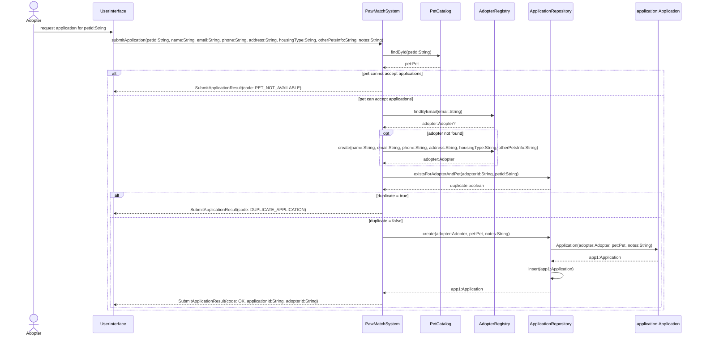
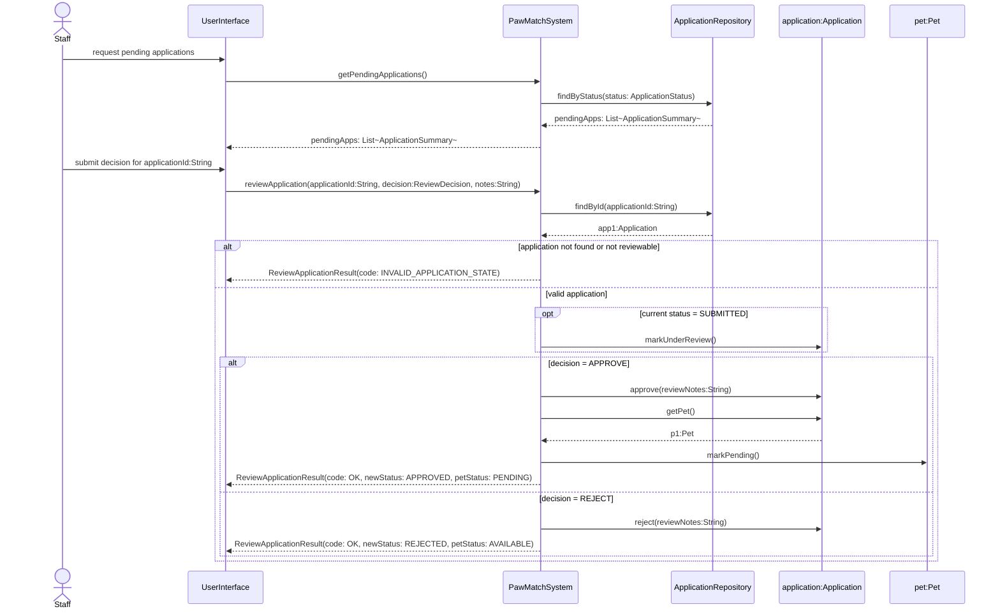
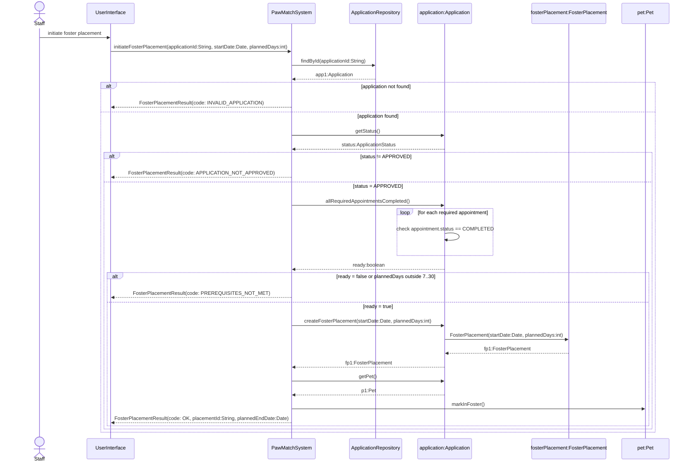
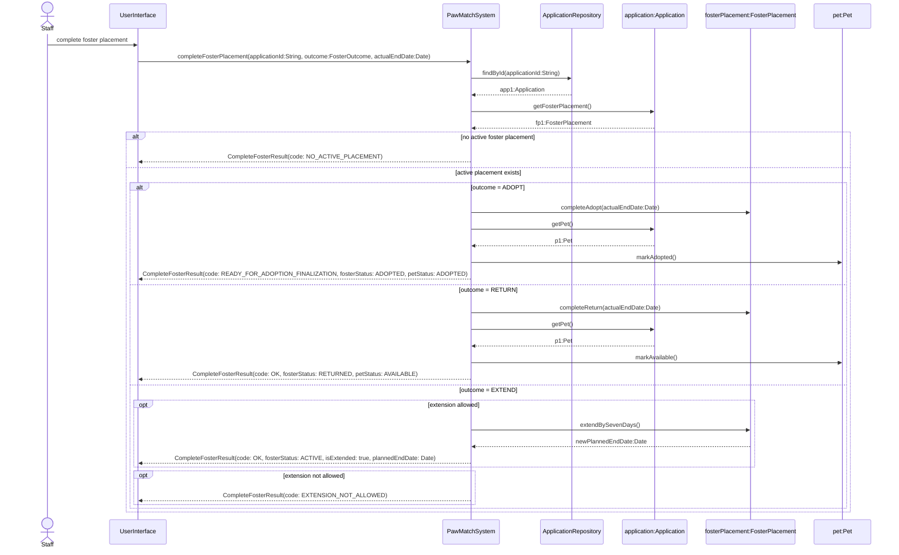
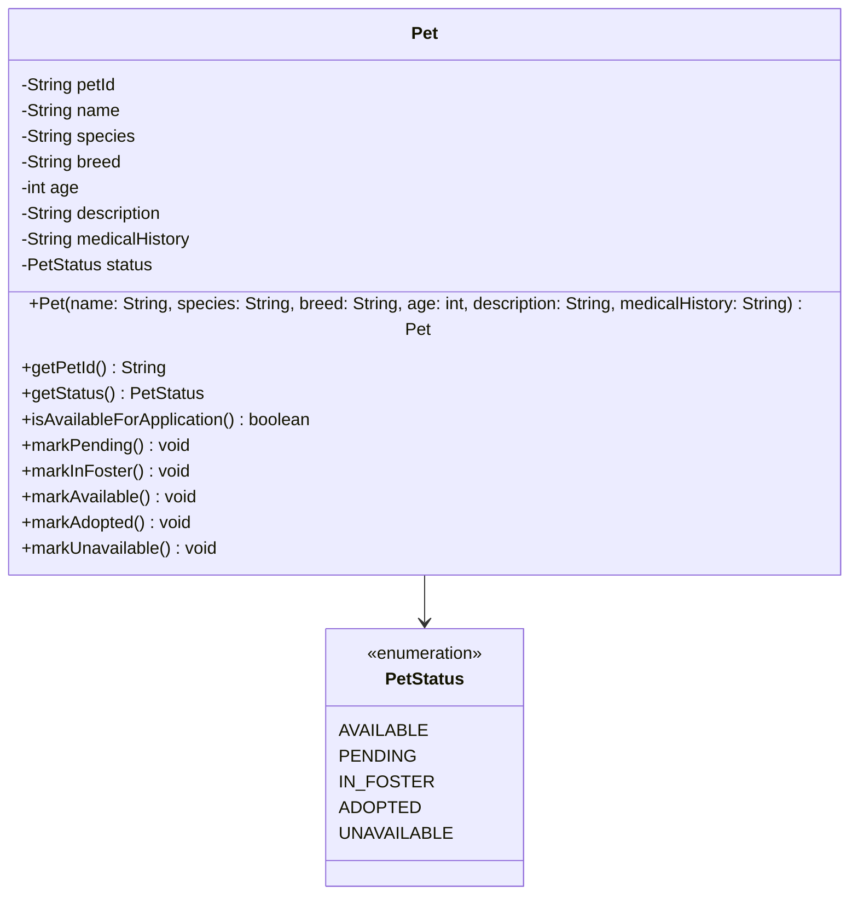
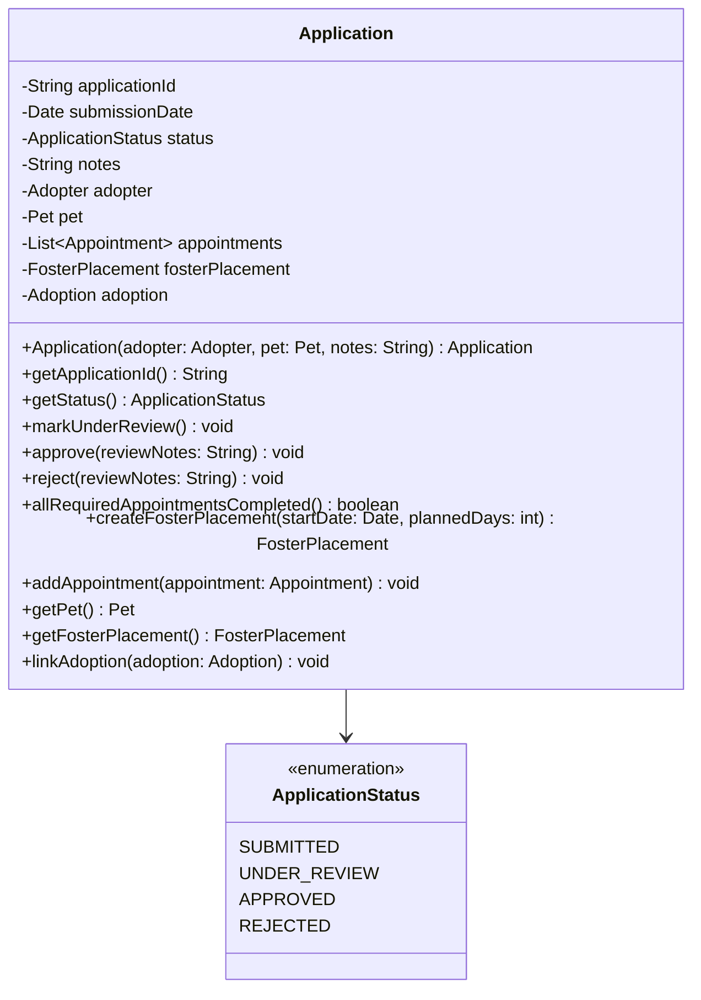
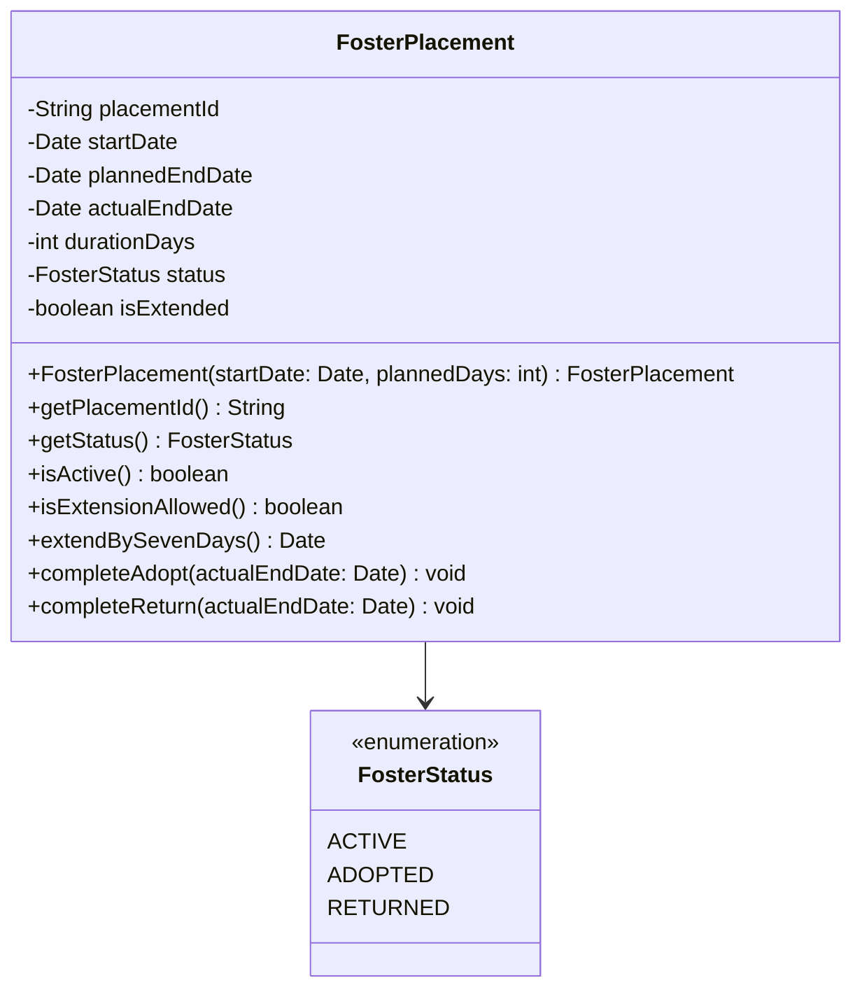

# Assignment 2: PawMatch System Design

**Name:** `[Your Full Name]`

---

## Part 1: Major Subsystems

### 1.1 Subsystem Table

| Subsystem Name                   | Primary Responsibility                                                                                                                                | What It Does NOT Handle                                                                      |
| -------------------------------- | ----------------------------------------------------------------------------------------------------------------------------------------------------- | -------------------------------------------------------------------------------------------- |
| `UserInterface`                  | Collects input from shelter staff and adopters, displays lists, confirmations, and reports                                                            | Does not execute business rules, change domain object state, or decide workflow validity     |
| `PawMatch Back-End`              | Implements all adoption-domain rules and coordinates use cases through the `PawMatchSystem` facade and domain classes                                 | Does not format screens, control user interaction flow, or store data directly in UI widgets |
| `Persistence / Repository Layer` | Stores and retrieves pets, adopters, and applications through collection classes such as `PetCatalog`, `AdopterRegistry`, and `ApplicationRepository` | Does not make business decisions such as approving applications or validating foster rules   |

### 1.2 Justification

**UserInterface:**

> The UI is restricted to interaction: receiving data on the actor, providing requests to the facade and showing the results returned. It must not have knowledge of how approval, foster, or adoption rules are implemented as it would strongly bind screens to business logic.

**PawMatch Back-End:**

> This subsystem contains the domain model and the `PawMatchSystem` facade. Its mandate is to implement business rules of the assignment, including preventing duplicate applications, pet status changes, appointments requirements and foster extension boundaries. Having such rules stored in the back-end provides the system with a single source of truth.

**Persistence / Repository Layer:**

> The repository layer is there due to the fact that the system has to search and repeatedly insert and retrieve collections of pets, adopters and applications. By centralizing such operations into collection classes, cohesion is enhanced and search logic is not scattered around domain objects.

**Why separation matters:**

> This division enhances **cohesion** since each subsystem performs only one job: interaction, business logic or storage. It also lessens coupling since the UI now communicates with the facade, rather than with `Pet`, `Application`, or `FosterPlacement` objects. In case of a later change in the domain rules, the UI must not demand much or no redesign provided that the facade contract remains unchanged.

---

## Part 2: Software Classes (10 points)

### 2.1 Complete Class List

| Class Name              | Corresponds to Conceptual Class? | Rationale for Decision                                                                                                                                          | Primary Responsibility                                                            |
| ----------------------- | -------------------------------- | --------------------------------------------------------------------------------------------------------------------------------------------------------------- | --------------------------------------------------------------------------------- |
| `PawMatchSystem`        | No — Facade (new class)          | Acts as the single entry point from UI into the back-end and prevents the UI from depending on internal object relationships                                    | Coordinates use cases and delegates work to repositories and domain objects       |
| `PetCatalog`            | No — collection class            | The system frequently creates, searches, and retrieves pets by ID and status; those collection responsibilities should not live inside individual `Pet` objects | Stores and retrieves `Pet` instances                                              |
| `AdopterRegistry`       | No — collection class            | The system must find existing adopters and create them when needed; centralizing that logic avoids duplicate search code                                        | Stores and retrieves `Adopter` instances                                          |
| `ApplicationRepository` | No — collection class            | Applications are the entry point for review, foster placement, completion, adopter history, and reporting, so they deserve their own searchable collection      | Stores and retrieves `Application` instances and supports application queries     |
| `Pet`                   | Yes                              | Has a clear data abstraction, many runtime instances, and meaningful commands/queries such as status checks and status transitions                              | Stores pet data and enforces valid pet-status changes                             |
| `Adopter`               | Yes                              | Has stable identity and data, many runtime instances, and participates in multiple applications over time                                                       | Stores adopter information and links to submitted applications                    |
| `Application`           | Yes                              | It is the central workflow object that links adopter, pet, appointments, foster placement, and adoption outcomes                                                | Tracks application lifecycle and related workflow objects                         |
| `Appointment`           | Yes                              | Appointments have their own attributes, validation rules, status, and multiple instances per application                                                        | Represents scheduled meet-and-greet, home visit, or foster pickup events          |
| `FosterPlacement`       | Yes                              | A foster placement has its own lifecycle, duration rules, and extension behavior that should not be merged into `Application`                                   | Tracks foster dates, status, and extension logic                                  |
| `Adoption`              | Yes                              | A completed adoption is a distinct finalized business record with fee and contract data                                                                         | Stores finalized adoption details                                                 |
| `AdopterHistory`        | No — supporting result class     | The “view adopter history” use case needs an aggregate response without exposing many unrelated internal collections directly to the UI                         | Packages an adopter’s applications, foster outcomes, adoptions, and success count |
| `AdoptionReport`        | No — supporting result class     | The reporting use case returns computed totals and summaries rather than a single domain object                                                                 | Packages report totals, adopted pets, fees, and average completion time           |

### 2.2 Excluded Conceptual Classes

| Conceptual Class | Why It Was Not Implemented as a Standalone Software Class                                                                                                                                                                           |
| ---------------- | ----------------------------------------------------------------------------------------------------------------------------------------------------------------------------------------------------------------------------------- |
| None             | Every conceptual class (`Adopter`, `Pet`, `Application`, `Appointment`, `FosterPlacement`, and `Adoption`) met the Chapter 5 tests: each has meaningful state, multiple runtime instances, and behavior beyond simple data storage. |

### 2.3 Key Design Decision: The Application Class

> I decided to place the `Application` objects in their own `ApplicationRepository`, not just to access them by `Adopter` or `Pet`. The most compelling one is that a number of use cases start by searching directly through applications: reviewing pending applications, starting foster placement based on an approved application, finalizing foster placement, and creating adopter history. A specialized collection maintains those search and filtering operations focused and does not make the facade have to wade through irrelevant items to find the appropriate application. The `Application` object continues to maintain references to its `Adopter` and `Pet`, but the look up action is in the repository.

---

## Part 3: Sequence Diagrams

---

### Diagram A:

**Algorithm:**

1. The adopter asks to apply for a specific pet.
2. The UI sends the pet ID and adopter/application details to `PawMatchSystem.submitApplication(...)`.
3. `PawMatchSystem` retrieves the pet from `PetCatalog`.
4. If the pet is not available for applications, the facade returns an error result.
5. Otherwise, the facade looks up the adopter in `AdopterRegistry` using the email address.
6. If no adopter exists, the facade creates a new `Adopter` and stores it in the registry.
7. The facade asks `ApplicationRepository` whether the adopter has already applied for that pet.
8. If a duplicate exists, the facade returns an error result.
9. Otherwise, the repository creates a new `Application`, inserts it, and returns it.
10. The facade returns a result object containing the result code and the new application ID.

**Sequence Diagram:**

**Return Type Decision:**

> `PawMatchSystem.submitApplication()` returns a small result object, such as `SubmitApplicationResult`, rather than a formatted confirmation string or the raw `Application` object. This follows two important UI-coupling principles. First, the UI should remain free to decide how to present the confirmation. Second, the UI should not need to understand internal domain relationships just to display whether the action succeeded or failed.

---

### Diagram B: Review Application

**Algorithm (plain English — complete this before drawing):**

1. Staff requests the list of pending applications.
2. The UI calls `PawMatchSystem.getPendingApplications()`.
3. The facade retrieves all pending applications from `ApplicationRepository` and returns summaries to the UI.
4. Staff selects one application and provides a decision and notes.
5. The UI calls `PawMatchSystem.reviewApplication(...)`.
6. The facade retrieves the application from the repository.
7. If the application is not in a reviewable state, the facade returns an error result.
8. Otherwise, the application is marked under review if needed.
9. If the decision is approve, the application becomes approved and the linked pet becomes pending.
10. If the decision is reject, the application becomes rejected and the pet remains available.
11. The facade returns a result object containing the outcome and new statuses.

**Sequence Diagram:**

**Return Type Decision:**

> `reviewApplication()` returns a result object with a result code and the new application/pet statuses. That is enough information for the UI to update the screen without exposing the full `Application` object graph. Returning domain-neutral data keeps the UI loosely coupled while still giving it enough information to present an accurate confirmation.

---

### Diagram C: Initiate Foster Placement

**Algorithm (plain English — complete this before drawing):**

1. Staff initiates foster placement for a specific application.
2. The UI sends the application ID, start date, and planned duration to `PawMatchSystem.initiateFosterPlacement(...)`.
3. The facade retrieves the application from `ApplicationRepository`.
4. If the application is not approved, the facade returns an error.
5. The facade asks the application whether all required appointments are completed.
6. The application checks its appointments one by one.
7. If prerequisites fail or the duration is outside 7–30 days, the facade returns an error.
8. Otherwise, the application creates a `FosterPlacement`.
9. The facade retrieves the linked pet and changes its status to `IN_FOSTER`.
10. The facade returns a result object containing the placement ID and planned end date.

**Sequence Diagram:**

**Return Type Decision:**

> `initiateFosterPlacement()` returns a result object with the result code, placement ID, and planned end date. I did not return the raw `FosterPlacement` object because that would force the UI to know more about domain internals than it needs. A simple result object lets the UI display confirmation in any format while keeping business logic inside the back-end.

---

### Diagram D: Complete Foster Placement

**Algorithm (plain English — complete this before drawing):**

1. Staff initiates completion for an application’s active foster placement.
2. The UI sends the application ID, foster outcome, and actual end date to `PawMatchSystem.completeFosterPlacement(...)`.
3. The facade retrieves the application and its foster placement.
4. If there is no active foster placement, the facade returns an error.
5. If the outcome is Adopt, the foster placement changes to adopted and the pet becomes adopted.
6. If the outcome is Return, the foster placement changes to returned and the pet becomes available.
7. If the outcome is Extend, the system checks whether an extension is still allowed.
8. If extension is allowed, the foster placement extends by 7 days and remains active.
9. If extension is not allowed, the facade returns an error result.
10. The facade returns a result object describing the outcome and any updated dates/statuses.

**Sequence Diagram:**

**Return Type Decision:**

> `completeFosterPlacement()` returns a result object rather than directly calling the next use case. In the Adopt branch, I return a special code such as `READY_FOR_ADOPTION_FINALIZATION` so the UI can decide whether to immediately trigger `finalizeAdoption()` or route the staff member to a confirmation screen. That keeps the UI in control of interaction flow while still keeping foster-completion business rules in the back-end.

---

## Part 4: Class Design (12 points)

---

### Class A: Pet

#### Methods Summary Table

| Sequence Diagram                     | Method Signature                                                                                           | Description                                                                |
| ------------------------------------ | ---------------------------------------------------------------------------------------------------------- | -------------------------------------------------------------------------- |
| Use Case 1 analysis (not diagrammed) | `Pet(name: String, species: String, breed: String, age: int, description: String, medicalHistory: String)` | Constructor; generates `petId` and sets status to `AVAILABLE`              |
| Submit Adoption Application          | `isAvailableForApplication() boolean`                                                                      | Checks whether the pet can receive a new application                       |
| Review Application                   | `markPending() void`                                                                                       | Changes pet status to `PENDING` after an application is approved           |
| Initiate Foster Placement            | `markInFoster() void`                                                                                      | Changes pet status to `IN_FOSTER` when foster placement begins             |
| Complete Foster Placement            | `markAvailable() void`                                                                                     | Changes pet status back to `AVAILABLE` after a returned foster             |
| Complete Foster Placement            | `markAdopted() void`                                                                                       | Changes pet status to `ADOPTED` after a successful foster-to-adopt outcome |

#### Class Diagram

#### Status Attribute Decision

> I stored `status` as the enumeration `PetStatus` rather than a raw `String` or integer constant. An enum makes the allowed states explicit, prevents misspellings such as `"In foster"` versus `"In Foster"`, and makes switch/branch logic easier to read and maintain.

---

### Class B: Application

#### Methods Summary Table

| Sequence Diagram                                                           | Method Signature                                                           | Description                                                                                      |
| -------------------------------------------------------------------------- | -------------------------------------------------------------------------- | ------------------------------------------------------------------------------------------------ |
| Submit Adoption Application                                                | `Application(adopter: Adopter, pet: Pet, notes: String)`                   | Constructor; generates `applicationId`, sets status to `SUBMITTED`, and records `submissionDate` |
| Review Application                                                         | `markUnderReview() void`                                                   | Moves application from `SUBMITTED` to `UNDER_REVIEW`                                             |
| Review Application                                                         | `approve(reviewNotes: String) void`                                        | Sets status to `APPROVED` and stores review notes                                                |
| Review Application                                                         | `reject(reviewNotes: String) void`                                         | Sets status to `REJECTED` and stores review notes                                                |
| Initiate Foster Placement                                                  | `allRequiredAppointmentsCompleted() boolean`                               | Checks whether all required appointments have status `COMPLETED`                                 |
| Initiate Foster Placement                                                  | `createFosterPlacement(startDate: Date, plannedDays: int) FosterPlacement` | Creates and links a new foster placement to this application                                     |
| Complete Foster Placement                                                  | `getFosterPlacement() FosterPlacement`                                     | Returns the linked foster placement for completion processing                                    |
| Review Application / Initiate Foster Placement / Complete Foster Placement | `getPet() Pet`                                                             | Returns the pet linked to the application                                                        |

#### Class Diagram

#### Status Attribute Decision

> I used the enumeration `ApplicationStatus` because the application lifecycle is tightly constrained by business rule BR-3. An enum makes invalid values impossible at compile time and communicates the legal transitions more clearly than a plain `String`.

---

### Class C: FosterPlacement

#### Methods Summary Table

| Sequence Diagram          | Method Signature                                     | Description                                                                                                                         |
| ------------------------- | ---------------------------------------------------- | ----------------------------------------------------------------------------------------------------------------------------------- |
| Initiate Foster Placement | `FosterPlacement(startDate: Date, plannedDays: int)` | Constructor; generates `placementId`, calculates `plannedEndDate`, sets status to `ACTIVE`, and initializes `isExtended` to `false` |
| Complete Foster Placement | `completeAdopt(actualEndDate: Date) void`            | Sets status to `ADOPTED` and records the actual end date                                                                            |
| Complete Foster Placement | `completeReturn(actualEndDate: Date) void`           | Sets status to `RETURNED` and records the actual end date                                                                           |
| Complete Foster Placement | `isExtensionAllowed() boolean`                       | Checks whether the placement has not already been extended                                                                          |
| Complete Foster Placement | `extendBySevenDays() Date`                           | Adds 7 days to `plannedEndDate`, sets `isExtended` to `true`, and returns the new planned end date                                  |
| Complete Foster Placement | `isActive() boolean`                                 | Checks whether the foster placement is currently active                                                                             |

#### Class Diagram

#### Status Attribute Decision

> I used the enumeration `FosterStatus` for the same reason as the other lifecycle classes: the valid states are small, fixed, and meaningful. Using an enum is safer than strings and simpler than introducing a full State pattern for a workflow with only three stable states.

---

## Part 5: Design Reflection

---

### 5.1 Hardest Decision

> The hardest design decision was whether `Application` objects should live in their own collection class or only be reachable through `Pet` or `Adopter`. I considered the simpler option first because every application is tied to one adopter and one pet. However, when I worked through the use cases, too many workflows started by locating an application directly: review, foster initiation, foster completion, adopter history, and reporting. That pushed me toward `ApplicationRepository`, because it made the lookup path match the actual behavior of the system.

### 5.2 Cohesion and Coupling in Practice

> One concrete coupling decision was returning small result objects from `PawMatchSystem` instead of raw domain objects such as `Application` or `FosterPlacement`. If I had returned the domain objects directly, the UI would need to know their internal structure and relationships, which would make later refactoring harder. By returning `SubmitApplicationResult`, `ReviewApplicationResult`, and similar response objects, I kept business objects cohesive and prevented UI code from becoming dependent on internal domain design.

### 5.3 Responsibility Assignment

> I assigned `allRequiredAppointmentsCompleted()` to `Application` rather than `PawMatchSystem` or `Appointment`. The reason is the “shoemaker must not look past the sandal” principle: `Application` owns the collection of appointments and knows which appointments are part of its own workflow. If the facade performed that check itself, it would have to inspect appointment internals directly and accumulate logic that belongs closer to the data. This assignment keeps the facade as coordinator and the application as owner of its own readiness rules.

### 5.4 Design Patterns

> Beyond the Facade, I also used a lightweight **Repository/Collection** pattern through `PetCatalog`, `AdopterRegistry`, and `ApplicationRepository`. I considered using a full **State** pattern for pet, application, and foster lifecycles, but I chose not to because the state spaces are small and the transition rules are still manageable inside domain methods backed by enums. A State pattern could be justified later if transitions become more complex, but for this assignment it would add indirection without enough payoff.

---
